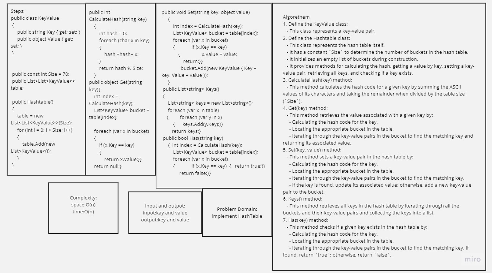

# HashTable

A hashtable, also known as a hash table or hash map, is a data structure that stores key-value pairs in a way that allows for efficient retrieval of values based on their associated keys. It is widely used in computer science and programming because of its ability to provide fast access to data.

