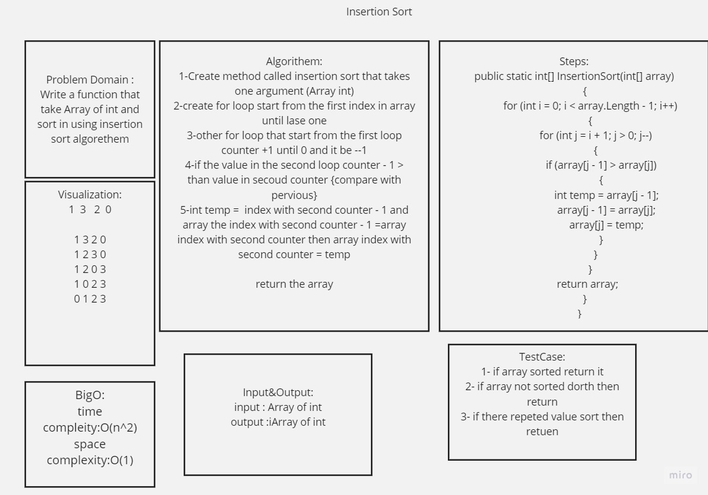

# Insartion Sort 

 

### How the algorethen is work ?

In insertion sort method 
First : create method called Insert it iakes 2 parameter
Array of sort int valus and int value
then create variable for example called (i) and its equal 0 
then create while loop and the condition is while the value is 
bigger than the int value in array contenues 
and join forr loop and let i +1
then other while loop and the condetion 
while i < array.length
variable temp will equal array[i]
array[i] will equal value 
value will equal tepm 
then i will equal i+1

the seconf method 
InsertionSort method it takes one argument 
array of int then create new array
this new array is empty
the fiest index in array equal the first index in new array
here create for loops 
tart from 1 and finish in array. lenght

call the first method insert and give it the new array and int value
return the new array

