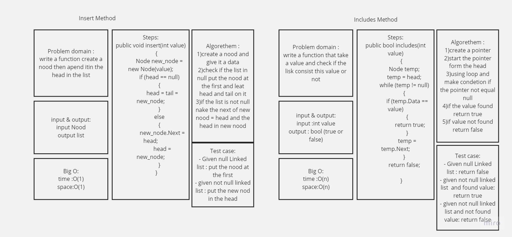
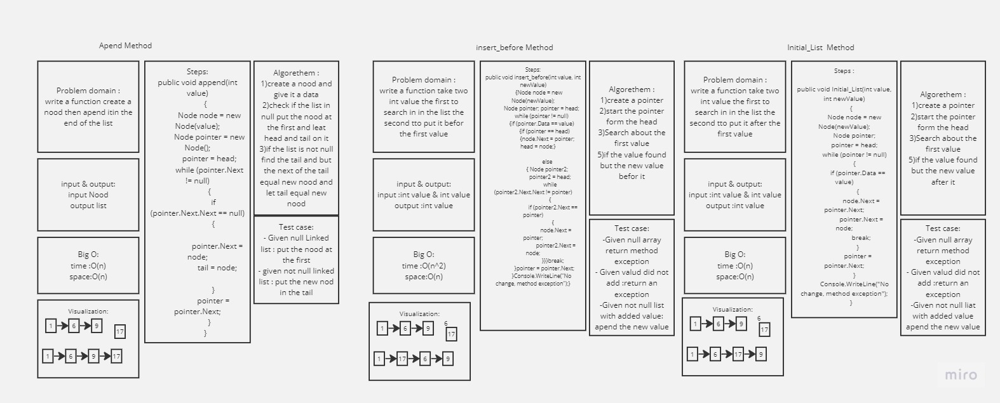
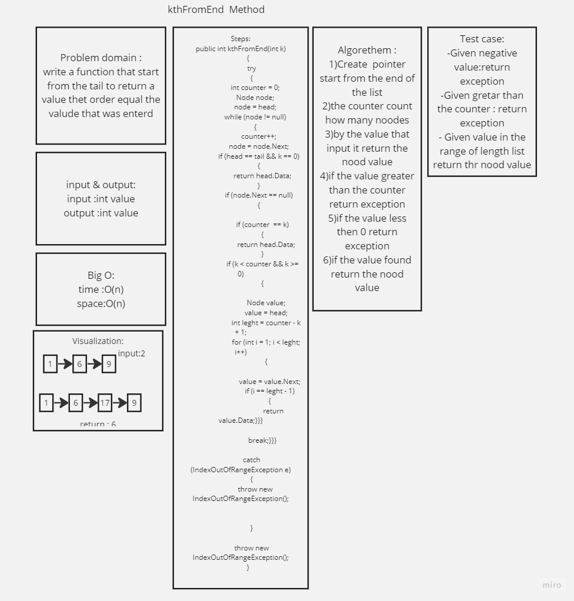
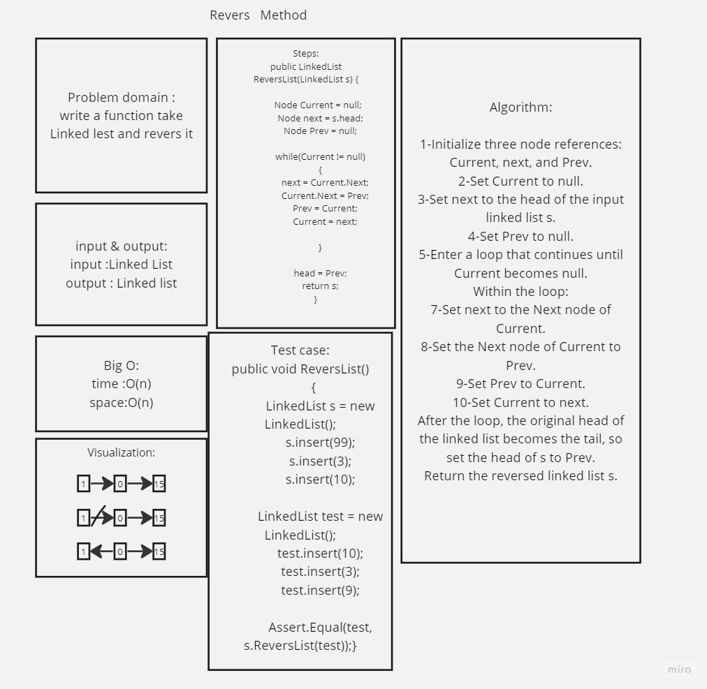

# Linked List 

Linkes List is a data structures use to store data with more flexible

function :

1- add to the first 

2- search if the data is add or not

3- pring the list

4- Add befor value

5- Add after value

6- Add At the end of the list

7- Search fron the end about value by its order in list

8- revers the linked list
 

this code written by C# language to start it just create an object from class 
Linked list and then can access any other method thet create on it.

