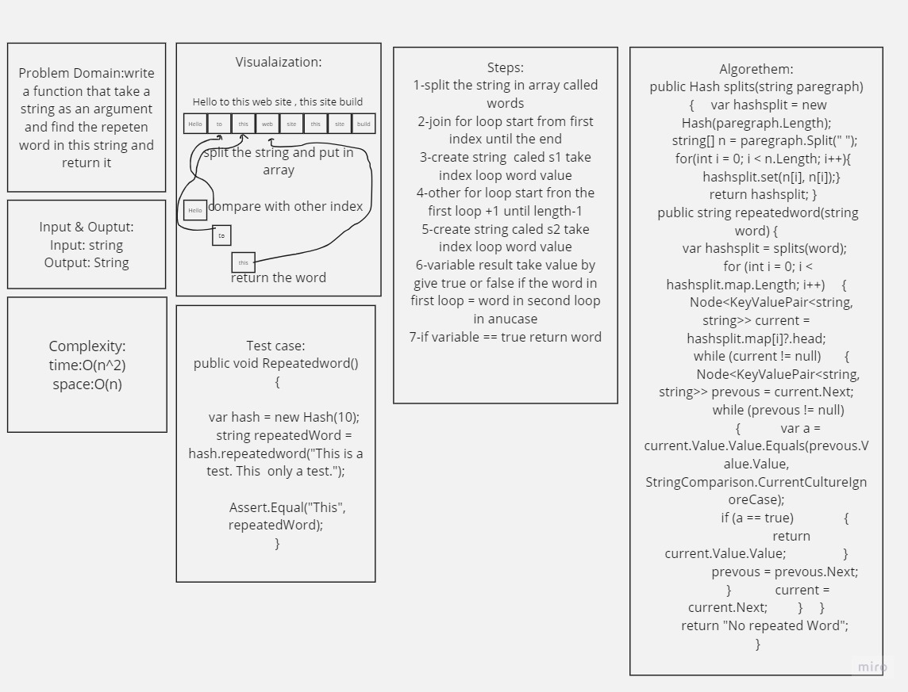

# Find Repeted Word

## What is this algorethem do:
it takes string and splitit in array by space between words then return if there is a repeted word

## how to use it
call the method with send the prameter then print the result

## Build in method used
split : [for infornation](https://learn.microsoft.com/en-us/dotnet/csharp/how-to/parse-strings-using-split)

 

Equals :[for information](https://learn.microsoft.com/en-us/dotnet/api/system.object.equals?view=net-7.0)

## Whiht Bord

