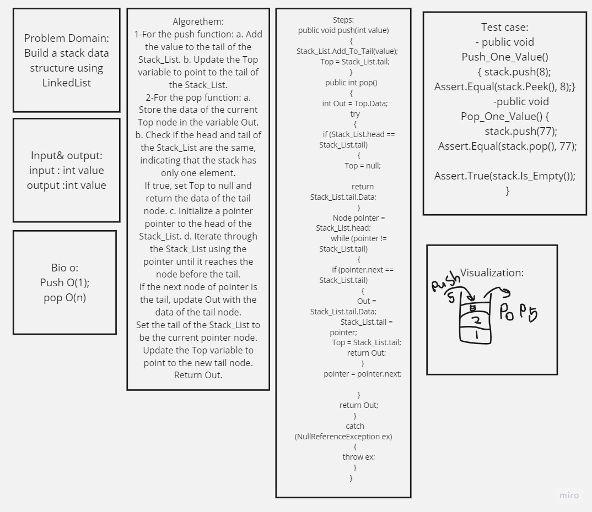
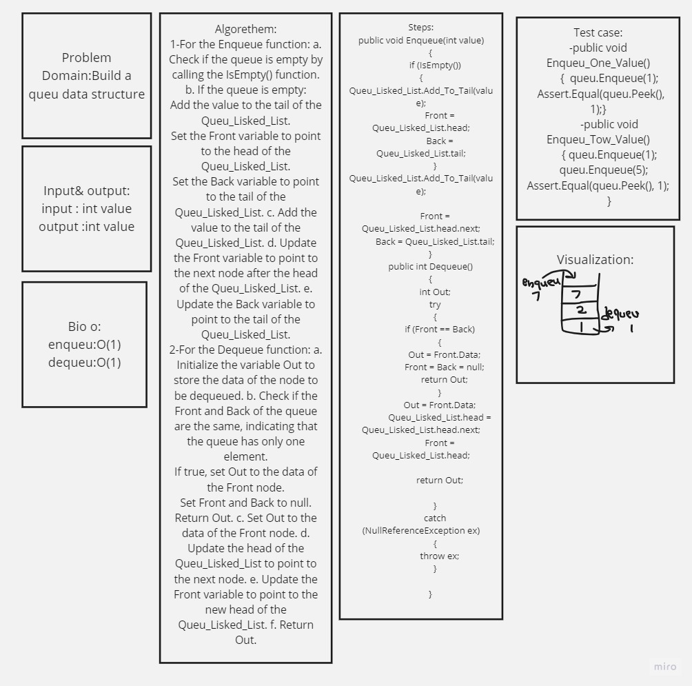

# Stack & Queu

## Stack:
is a data structure to sorte data as a nood using list (it can be using with array also)

## implemntation :
Stake has push to add value to the stake and pop to delet (the add and delet done from the tail)

FIFO: first in first out 

## Queu 
is a data structure to sorte data as a nood using list (it can be using with array also)
## implemntation :
Queu has enqueu to ad in queu and dequeu to delet from it (add ne in the tail and the delet be in the tail)

FILO: First in first out

