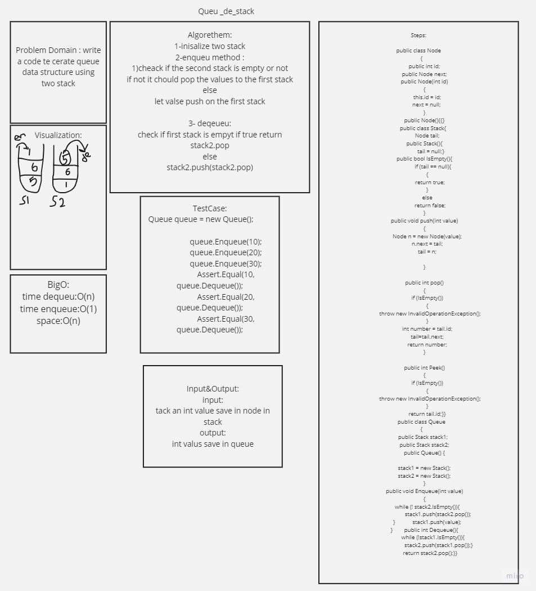

# stack queue pseudo 

## discerption:

write queue data structure using stack 

## steps :
- create stack
- put value in stack using push 
- pop the value from stack and push them in other seack
- pop them again 

white boord 

